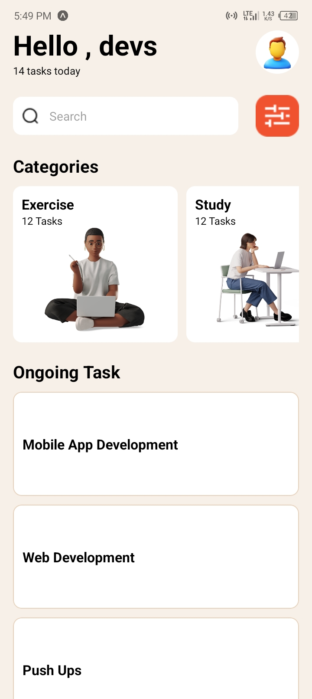
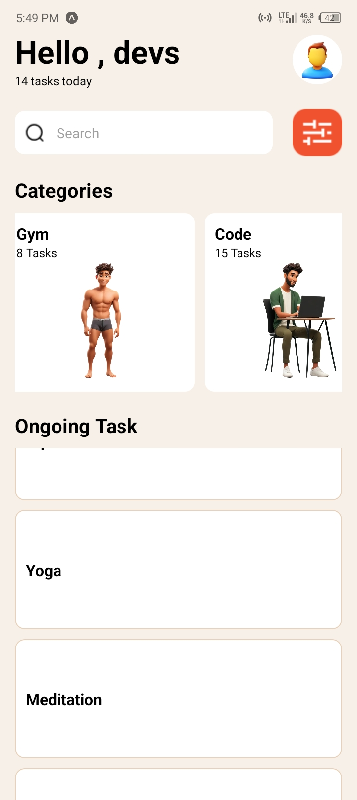
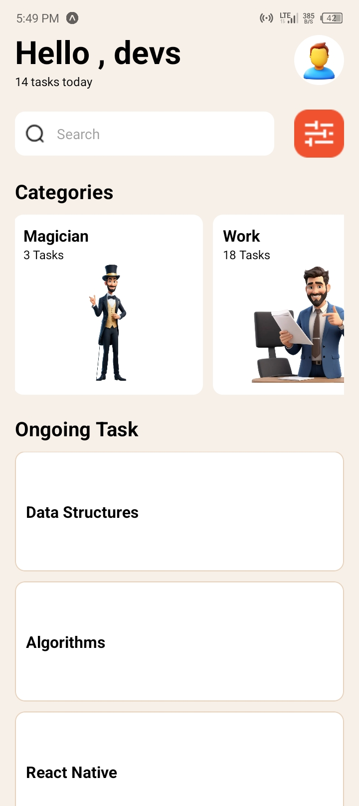

## 11024515

The application has four main components. They include:

* Header Component: This component displays a Hello, devs message, the tasks the user has today and profile image of the user.
* SearchBar Component: This component displays a search day that allows the user to search and a filter icon for the user to filter their search results.
* Categories Component: This component displays the various categories available in the app to the user.
* Ongoing Task Component: This component displays the tasks the user has ongoing.
  

